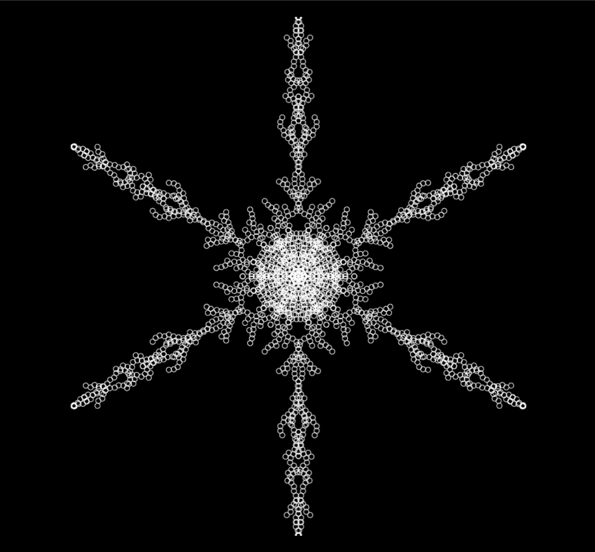

Snowflake
=========

We will do this project as a livecoding exercise in the classroom.
This project software simulates a biological process called “diffusion limited aggregation” to produce the beautiful and unique snowflakes.

The software uses a design pattern called “random walker” which is a random motion to create a walk but preferentially towards the center of the frame. However, the walk is not a straight path or in equidistant steps. Each clump of molecules (a single circle in the picture) has a mixture of motion in the NEWS  directions as it moves inexorably towards the center.  When it encounters another clump along the way, it stops moving (sticks to it) - this is where the “diffusion limited aggregation” aspect is realized.  

So, now we have a  single “spoke” built up in memory in an ArrayList - you can think of this as a dynamic array that can grow in size as needed.  All that is left to do is read the ArrayList one circle at a time and show the build-up on the screen as tiny circles.  So now you see why the snowflake builds from the inside-out. 

As you draw one single spoke on the canvas, ```rotate()``` and ```translate()``` by 2*PI / 6 (or PI / 3) radians and draw five more. You may also want to mirror each spoke with the ```scale()``` commandThen you do it again for the next spoke and the next one and so on.  

Jingle Jingle - there you have it.

### [Click here to see the animation expected from your Java program](https://youtu.be/fIpWDhBITps)


